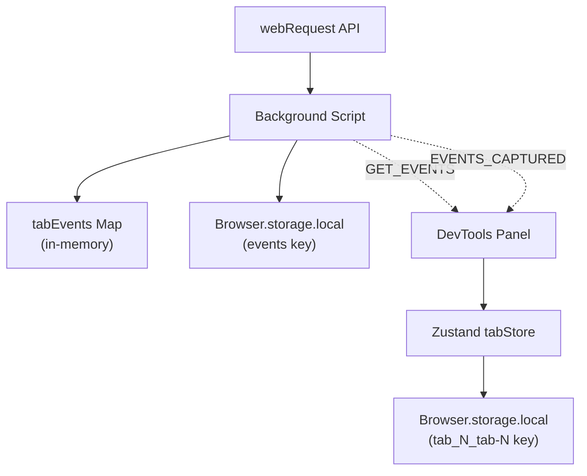
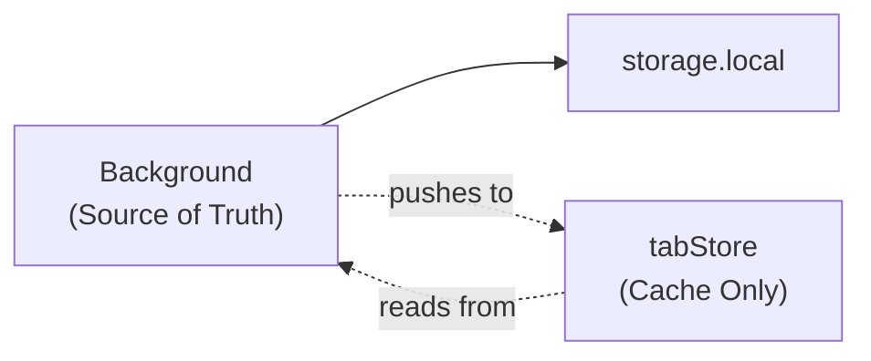

# Architecture Improvements

## Problem

The current architecture has complexity from rapid development that can lead to sync issues and crashes.---

## 1. Dual Storage Strategy Creates Complexity

### Current State

Events are stored in THREE places simultaneously:



This causes:

- Deduplication logic in multiple places
- Potential sync issues between stores
- Confusion about which is the source of truth

### Current Flow

1. Background captures event via webRequest
2. Background stores in `tabEvents` Map AND `Browser.storage.local['events']`
3. Background sends `EVENTS_CAPTURED` message
4. Panel receives and adds to tabStore
5. tabStore persists to `Browser.storage.local['tab_N_tab-N']`

### Recommended Solution

**Option A: Background as Single Source of Truth**Remove tabStore persistence, use it as a read-through cache:



Changes:

- Remove `persist` middleware from tabStore
- tabStore becomes ephemeral UI state only
- All event data flows from background

**Option B: TabStore as Single Source of Truth**Remove background's Map and let tabStore own persistence:

- Background only captures and forwards events
- No in-memory Map in background
- tabStore handles all persistence

### Recommendation

**Option A** is cleaner because:

- Background already handles persistence for service worker restarts
- Simpler mental model
- Less storage usage (no duplicate keys)

---

## 2. Tab Store Registry is Module-Level Global

### Current State

[`src/stores/tabStore.ts`](src/stores/tabStore.ts) uses a module-level Map:

```typescript
const tabStoreRegistry = new Map<number, ReturnType<typeof createTabStore>>();

export const getTabStore = (tabId: number, maxEvents: number = 500) => {
  if (!tabStoreRegistry.has(tabId)) {
    tabStoreRegistry.set(tabId, createTabStore(tabId, maxEvents));
  }
  return tabStoreRegistry.get(tabId)!;
};
```

Issues:

- Not reactive (React can't know when stores are added/removed)
- Can cause issues with HMR
- Difficult to test

### Solution

Create a registry store using Zustand:

```typescript
interface TabStoreRegistry {
  stores: Map<number, ReturnType<typeof createTabStore>>;
  getOrCreate: (tabId: number, maxEvents?: number) => ReturnType<typeof createTabStore>;
  remove: (tabId: number) => void;
}

export const useTabStoreRegistry = create<TabStoreRegistry>((set, get) => ({
  stores: new Map(),
  getOrCreate: (tabId, maxEvents = 500) => {
    const existing = get().stores.get(tabId);
    if (existing) return existing;
    
    const store = createTabStore(tabId, maxEvents);
    set((state) => {
      const newStores = new Map(state.stores);
      newStores.set(tabId, store);
      return { stores: newStores };
    });
    return store;
  },
  remove: (tabId) => {
    set((state) => {
      const newStores = new Map(state.stores);
      newStores.delete(tabId);
      return { stores: newStores };
    });
  },
}));
```

---

## 3. Missing Error Boundaries

### Current State

No error boundaries exist. If any component throws, the entire panel crashes with no recovery.

### Solution

Create error boundary components:

```typescript
// src/components/ErrorBoundary.tsx
interface Props {
  children: React.ReactNode;
  fallback: React.ReactNode;
  onError?: (error: Error, errorInfo: React.ErrorInfo) => void;
}

class ErrorBoundary extends React.Component<Props, { hasError: boolean }> {
  // ... implementation
}
```

Add boundaries around:

```tsx
// Panel.tsx
<ErrorBoundary fallback={<PanelErrorState />}>
  <Header ... />
  <ErrorBoundary fallback={<EventListErrorState />}>
    <EventList ... />
  </ErrorBoundary>
</ErrorBoundary>
```

---

## Files to Create

| File | Purpose ||------|---------|| `src/components/ErrorBoundary.tsx` | Reusable error boundary || `src/components/ErrorStates.tsx` | Error UI components |

## Files to Modify