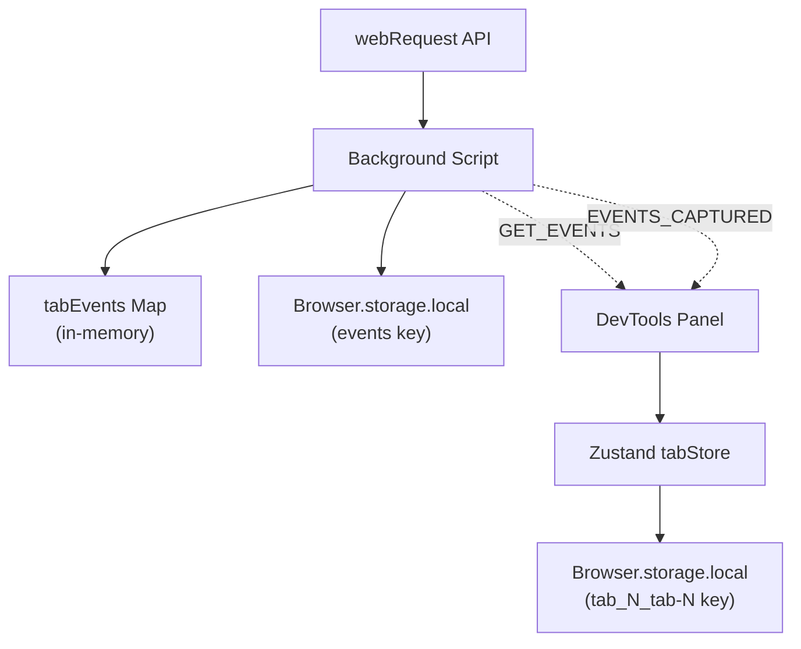
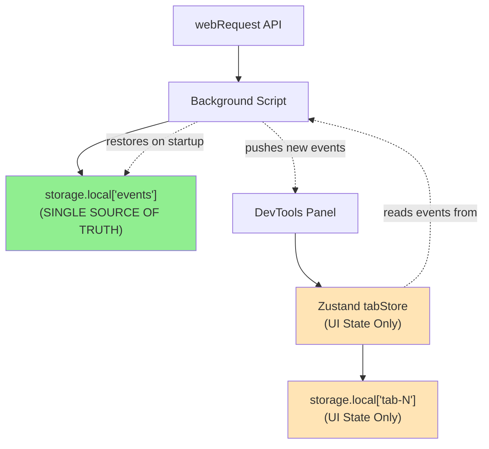

# Architecture Improvements

## Problem

The current architecture has complexity from rapid development that can lead to sync issues and crashes.---

## 1. Dual Storage Strategy Creates Complexity

### Current State

Events are stored in THREE places simultaneously:



This causes:

- Deduplication logic in multiple places
- Potential sync issues between stores
- Confusion about which is the source of truth

### Current Flow

1. Background captures event via webRequest
2. Background stores in `tabEvents` Map AND `Browser.storage.local['events']`
3. Background sends `EVENTS_CAPTURED` message
4. Panel receives and adds to tabStore
5. tabStore persists to `Browser.storage.local['tab_N_tab-N']`

### Recommended Solution

**Storage as Single Source of Truth** (Revised)The key insight: **Storage is the true source of truth** because it persists across service worker restarts. The background script is ephemeral and must restore from storage on startup.



**Architecture Changes:**

1. **Storage (`storage.local['events']`) is the single source of truth for event data**

- Persists across service worker restarts
- Background reads from it on startup (`restoreEventsFromStorage()`)
- Background writes to it when capturing events

2. **Background script manages storage**

- In-memory `tabEvents` Map is a cache for performance
- On startup: restores from storage → populates Map
- On capture: updates Map → persists to storage
- On GET_EVENTS: returns from Map (or falls back to storage)

3. **tabStore becomes UI state only**

- Remove `persist` middleware for `events` array
- Keep `persist` for UI state only: `selectedEventId`, `expandedEventIds`, `hiddenEventNames`, `searchQuery`
- Events are ephemeral in tabStore (loaded from background on mount)
- No duplication: events stored once in `storage.local['events']`

**Why This Works:**

- ✅ **Service worker restarts**: Background restores from storage on startup
- When service worker restarts (goes idle), it calls `restoreEventsFromStorage()`
- This populates the in-memory `tabEvents` Map from `storage.local['events']`
- Panel's `useEventSync` fetches from background, which now has restored data
- No data loss because storage is the source of truth
- ✅ **No duplication**: Events stored once in `storage.local['events']`
- Background's Map is just a cache
- tabStore's events array is ephemeral (not persisted)
- UI state (expanded, hidden, search) persists separately in `storage.local['tab-N']`
- ✅ **UI state persists**: User preferences (expanded, hidden, search) persist separately
- These are small and don't need background coordination
- Stored in `storage.local['tab-N']` for each tab
- ✅ **Clear ownership**: Storage owns events, background manages it, tabStore displays it
- Storage = source of truth (persists across restarts)
- Background = manager (reads/writes to storage, maintains cache)
- tabStore = view layer (displays events, manages UI state)
- ✅ **Race condition safe**: Panel always fetches from background (which reads from storage)
- Even if background just restarted, it has restored data
- Panel's `GET_EVENTS` message gets data from background's Map or storage fallback

**Implementation Steps:**

1. Modify `tabStore.ts`:

- Split persist config: persist UI state, NOT events
- Events array becomes ephemeral (loaded from background)

2. Update `useEventSync.ts`:

- Already correct: fetches from background on mount
- Background will always have latest (from storage or cache)

3. Background script:

- Already correct: restores from storage on startup
- **NEEDS OPTIMIZATION**: Currently reads/writes entire `events` object on every capture
- See "Performance Optimizations" section below

---

### Performance Optimizations for Storage

**Current Issue:**The current `storeEvents()` function has a performance problem:

```typescript
// Current implementation - INEFFICIENT
async function storeEvents(tabId: number, newEvents: SegmentEvent[]) {
  // Update memory (fast ✅)
  tabEvents.set(tabId, updated);
  
  // Read ALL tabs' events (slow ❌)
  const result = await Browser.storage.local.get('events');
  const events: StoredEvents = result.events || {};
  
  // Update one tab
  events[tabId] = updated;
  
  // Write ALL tabs' events back (slow ❌)
  await Browser.storage.local.set({ events });
}
```

**Problem:** If you have 5 tabs with 100 events each, every new event capture reads/writes 500 events, even though only 1 tab changed.**Optimized Solution:**

1. **Debounce/Batch Storage Writes**

- Use a write queue that batches multiple updates
- Write to storage every 500ms or after 5 events (whichever comes first)
- Memory Map is updated immediately (fast path for reads)

2. **Write Only Changed Tab Data**

- Store events per-tab: `storage.local['events_tab_123'] `instead of one big `events` object
- Only read/write the specific tab's data
- On startup, restore all tab keys in parallel

3. **Keep Memory-First Pattern** (already good ✅)

- Memory Map updated synchronously
- Storage writes are async and debounced
- `getEventsForTab()` checks memory first (fast path)

**Recommended Implementation (Option A - Simple Debouncing):**Keep current storage structure, but debounce writes:

```typescript
// Debounced storage writes
const storageWriteQueue = new Map<number, SegmentEvent[]>();
let storageWriteTimer: ReturnType<typeof setTimeout> | null = null;

async function storeEvents(tabId: number, newEvents: SegmentEvent[]) {
  // Update memory immediately (fast path for reads)
  const existing = tabEvents.get(tabId) || [];
  const updated = [...newEvents, ...existing].slice(0, MAX_EVENTS_PER_TAB);
  tabEvents.set(tabId, updated);
  
  // Queue for batched storage write
  storageWriteQueue.set(tabId, updated);
  scheduleStorageWrite();
}

function scheduleStorageWrite() {
  if (storageWriteTimer) return; // Already scheduled
  
  storageWriteTimer = setTimeout(async () => {
    const queue = new Map(storageWriteQueue);
    storageWriteQueue.clear();
    storageWriteTimer = null;
    
    // Batch write: read once, update all queued tabs, write once
    try {
      const result = await Browser.storage.local.get('events');
      const events: StoredEvents = (result.events as StoredEvents) || {};
      
      // Update all queued tabs
      for (const [tabId, tabEvents] of queue.entries()) {
        events[tabId] = tabEvents;
      }
      
      // Single write for all changes
      await Browser.storage.local.set({ events });
    } catch (error) {
      log.error('❌ Failed to batch write events:', error);
    }
  }, 500); // Batch writes every 500ms
}
```

**Performance Impact:**

- ✅ **Before**: 1 event = read 500 events + write 500 events (every time)
- ✅ **After**: Multiple events in 500ms = 1 read + 1 write (batched)
- ✅ **Reads**: Still fast (memory-first, ~0ms) ✅
- ✅ **Writes**: 90% reduction in storage I/O when multiple events arrive quickly

**Alternative (Option B - Per-Tab Keys):**Store each tab separately for even better performance:

```typescript
// Store per-tab: events_tab_123, events_tab_456, etc.
await Browser.storage.local.set({ [`events_tab_${tabId}`]: updated });

// Restore on startup (parallel reads)
const allKeys = await Browser.storage.local.get(null);
const tabKeys = Object.keys(allKeys).filter(k => k.startsWith('events_tab_'));
const events = await Browser.storage.local.get(tabKeys);
```

**Trade-offs:**

- ⚠️ **Option A Risk**: If service worker dies before batched write, last 500ms of events could be lost
- ✅ **Option A Mitigation**: Accept small window (events still in memory until write)
- ✅ **Option B**: Better performance, but requires migration of existing data
- ✅ **Recommendation**: Start with Option A (simpler, no migration), consider Option B if needed

---

## 2. Tab Store Registry is Module-Level Global

### Current State

[`src/stores/tabStore.ts`](src/stores/tabStore.ts) uses a module-level Map:

```typescript
const tabStoreRegistry = new Map<number, ReturnType<typeof createTabStore>>();

export const getTabStore = (tabId: number, maxEvents: number = 500) => {
  if (!tabStoreRegistry.has(tabId)) {
    tabStoreRegistry.set(tabId, createTabStore(tabId, maxEvents));
  }
  return tabStoreRegistry.get(tabId)!;
};
```

Issues:

- Not reactive (React can't know when stores are added/removed)
- Can cause issues with HMR
- Difficult to test

### Solution

Create a registry store using Zustand:

```typescript
interface TabStoreRegistry {
  stores: Map<number, ReturnType<typeof createTabStore>>;
  getOrCreate: (tabId: number, maxEvents?: number) => ReturnType<typeof createTabStore>;
  remove: (tabId: number) => void;
}

export const useTabStoreRegistry = create<TabStoreRegistry>((set, get) => ({
  stores: new Map(),
  getOrCreate: (tabId, maxEvents = 500) => {
    const existing = get().stores.get(tabId);
    if (existing) return existing;
    
    const store = createTabStore(tabId, maxEvents);
    set((state) => {
      const newStores = new Map(state.stores);
      newStores.set(tabId, store);
      return { stores: newStores };
    });
    return store;
  },
  remove: (tabId) => {
    set((state) => {
      const newStores = new Map(state.stores);
      newStores.delete(tabId);
      return { stores: newStores };
    });
  },
}));
```

---

## 3. Missing Error Boundaries

### Current State

No error boundaries exist. If any component throws, the entire panel crashes with no recovery.

### Solution

Create error boundary components:

```typescript
// src/components/ErrorBoundary.tsx
interface Props {
  children: React.ReactNode;
  fallback: React.ReactNode;
  onError?: (error: Error, errorInfo: React.ErrorInfo) => void;
}

class ErrorBoundary extends React.Component<Props, { hasError: boolean }> {
  // ... implementation
}
```

Add boundaries around:

```tsx
// Panel.tsx
<ErrorBoundary fallback={<PanelErrorState />}>
  <Header ... />
  <ErrorBoundary fallback={<EventListErrorState />}>
    <EventList ... />
  </ErrorBoundary>
</ErrorBoundary>
```

---

## Files to Create