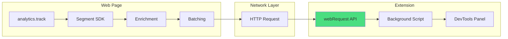

# Network-Level Segment Event Interception

## Problem with Current Approach

The current [`segment-events.mdc`](.cursor/rules/segment-events.mdc) rule describes intercepting `window.analytics` methods. This captures events **before** Segment processes them, missing critical attributes that Segment adds:| Missing Data | Description ||--------------|-------------|| `anonymousId` | Segment-generated anonymous user ID || `messageId` | Unique event identifier || `sentAt` / `receivedAt` | Accurate timestamps || `context.library` | Segment library version info || `integrations` | Which destinations receive this event || Batch structure | Events are batched before sending |

## Recommended Approach: Network Interception

Use Chrome's `webRequest` API to intercept HTTP requests to Segment's API endpoints. This captures the **final payload** exactly as it's sent.




## Target Endpoints

Segment and compatible services send data to these endpoints:

```typescript
const SEGMENT_ENDPOINTS = [
  '*://api.segment.io/*',           // Segment
  '*://api.segment.com/*',          // Segment alternate
  '*://*.rudderstack.com/*',        // Rudderstack
  '*://tracking.dreamdata.cloud/*', // Dreamdata
];
```


## Implementation Plan

### 1. Update Manifest Permissions

Add `webRequest` permission and host patterns in [`manifest.json`](manifest.json):

```json
{
  "permissions": [
    "webRequest",
    "storage",
    "tabs"
  ],
  "host_permissions": [
    "*://api.segment.io/*",
    "*://api.segment.com/*"
  ]
}
```


### 2. Background Script - Network Interception

Update [`src/pages/background/index.ts`](src/pages/background/index.ts) to use `chrome.webRequest.onBeforeRequest`:

```typescript
import Browser from 'webextension-polyfill';

Browser.webRequest.onBeforeRequest.addListener(
  (details) => {
    if (details.requestBody?.raw) {
      const payload = decodeRequestBody(details.requestBody.raw);
      // Parse and store the Segment event
    }
  },
  { urls: SEGMENT_ENDPOINTS },
  ['requestBody']
);
```


### 3. Parse Segment Payloads

Segment sends JSON payloads with this structure:interface SegmentPayload {

batch: Array<{

type: 'track' | 'page' | 'identify' | 'group' | 'alias';

event?: string;        // For track events

name?: string;         // For page events

properties?: Record<string, unknown>;

traits?: Record<string, unknown>;

anonymousId: string;

userId?: string;

messageId: string;

timestamp: string;

context: {

library: { name: string; version: string };

page: { url: string; title: string; ... };

// ... more context

};

}>;

sentAt: string;

writeKey: string;

}

### 4. Update segment-events.mdc Rule

Replace the injected script approach with network interception patterns and updated type definitions that reflect the actual Segment payload structure.

### 5. DevTools Panel Communication

The background script forwards captured events to the DevTools panel via `Browser.runtime.sendMessage`.

## Key Advantages

1. **Complete Data**: Captures all Segment-enriched attributes
2. **No Page Injection**: Doesn't modify page behavior or risk detection
3. **Accurate Timing**: Gets actual network timestamps
4. **Multi-Provider**: Same approach works for Rudderstack, Dreamdata, etc.
5. **Batched Events**: Sees the actual batched structure Segment uses

## Files to Modify