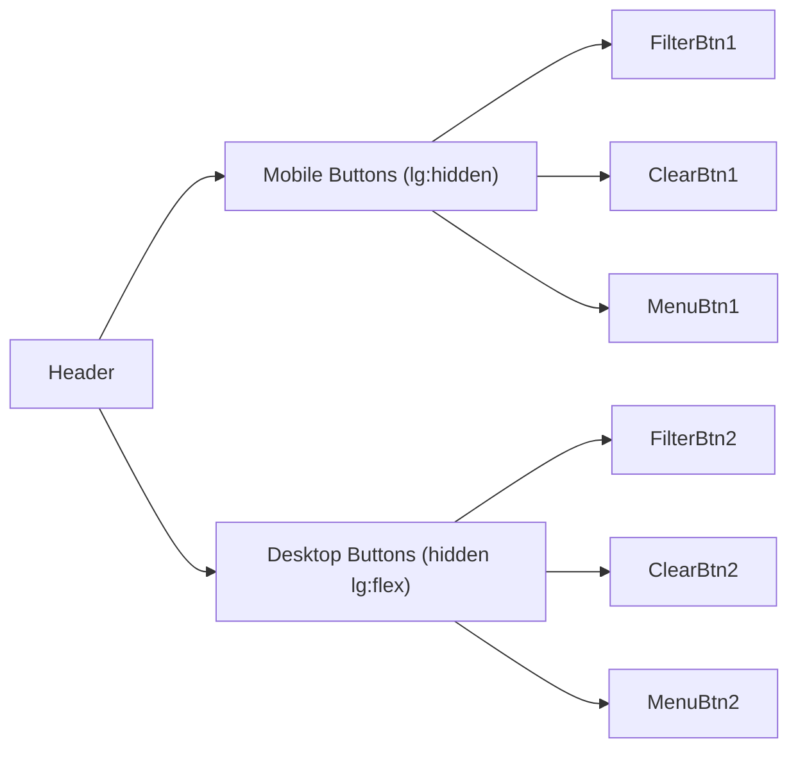
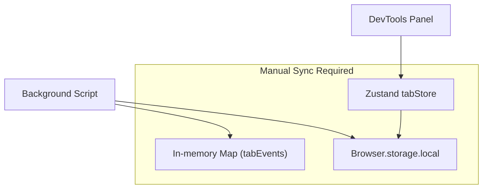

# Tech Debt Analysis and Refactoring Plan

## Summary

After a deep dive into the codebase, I've identified several areas of tech debt across architecture, code duplication, type safety, and missing abstractions. The codebase is generally well-structured but shows signs of rapid iteration that can be cleaned up.---

## 1. Dead Code and Unused Features

### Content Script is a Placeholder

The [`src/pages/content/index.tsx`](src/pages/content/index.tsx) file renders a debug banner but serves no functional purpose since event interception happens via webRequest in the background script.**Recommendation**: Either remove the content script entirely or repurpose it for future features like page overlay indicators.

### Unused Config Settings

The `throttleMs` setting in [`src/stores/configStore.ts`](src/stores/configStore.ts) (lines 65, 88) is exposed in Options but never actually used anywhere in the codebase.**Recommendation**: Either implement throttling in the event pipeline or remove the setting.---

## 2. Code Duplication

### Header Component Duplication

[`src/pages/devtools/components/Header.tsx`](src/pages/devtools/components/Header.tsx) duplicates the action buttons for mobile (lines 61-110) and desktop (lines 139-188) layouts.



**Recommendation**: Extract an `ActionButtons` component that takes a `className` prop for responsive styling.

### Search Highlighting Logic

The `highlightText` function usage and highlight rendering is duplicated in:

- [`EventDetailView.tsx`](src/pages/devtools/components/detail/EventDetailView.tsx) (lines 93-186)
- [`PropertyRow.tsx`](src/pages/devtools/components/detail/PropertyRow.tsx) (lines 127-150)

**Recommendation**: Create a shared `<HighlightedValue>` component that handles all value type highlighting consistently.

### JsonView Theme Configuration

The `getJsonViewTheme()` call and style object is repeated in multiple components:

- [`EventDetailView.tsx`](src/pages/devtools/components/detail/EventDetailView.tsx)
- [`PropertyRow.tsx`](src/pages/devtools/components/detail/PropertyRow.tsx)

**Recommendation**: Create a reusable `<ThemedJsonView>` wrapper component.---

## 3. Type System Improvements

### Missing Shared Message Types

`ExtensionMessage` interface is defined inline in [`src/pages/background/index.ts`](src/pages/background/index.ts) (lines 28-32) and again in [`useEventSync.ts`](src/pages/devtools/hooks/useEventSync.ts) (lines 22-28).**Recommendation**: Create [`src/types/messages.ts`](src/types/messages.ts):

```typescript
export type MessageType = 
  | 'GET_EVENTS' 
  | 'CLEAR_EVENTS' 
  | 'GET_EVENT_COUNT' 
  | 'EVENTS_CAPTURED';

export interface ExtensionMessage<T = unknown> {
  type: MessageType;
  tabId?: number;
  payload?: T;
}
```

### Type Assertions Could Be Type Guards

Several places use `as` type assertions that could be safer with type guards:

- [`src/pages/background/index.ts`](src/pages/background/index.ts) line 229
- [`src/pages/devtools/hooks/useEventSync.ts`](src/pages/devtools/hooks/useEventSync.ts) line 65

---

## 4. Architectural Concerns

### Dual Storage Strategy Creates Complexity

The current architecture maintains events in two places:



Events are stored in:

1. Background's in-memory `tabEvents` Map
2. `Browser.storage.local` (background persistence)
3. Per-tab Zustand stores (panel persistence)

This leads to deduplication logic in multiple places and potential sync issues.**Recommendation**: Consider a single source of truth pattern - either:

- Use only background storage with tabStore as a read-through cache
- Or remove background's Map and rely solely on storage

### Tab Store Registry is Global State

[`src/stores/tabStore.ts`](src/stores/tabStore.ts) lines 205-236 use a module-level `Map` outside of Zustand, which could cause issues with HMR and testing.**Recommendation**: Consider using a Zustand store to manage the registry itself.

### Missing Error Boundaries

No error boundaries are implemented anywhere. If a component throws, the entire panel crashes.**Recommendation**: Add error boundaries around:

- Main Panel component
- EventList (virtualized rendering)
- EventDetailView (JSON parsing/rendering)

---

## 5. Performance Improvements

### Search Lacks Debouncing

Search input in [`Header.tsx`](src/pages/devtools/components/Header.tsx) triggers immediate filtering on every keystroke, which recurses through entire event objects in [`search.ts`](src/lib/search.ts).**Recommendation**: Add debouncing (150-300ms) to `handleSearchChange` in Panel.

### PropertyRow State Could Be Consolidated

[`PropertyRow.tsx`](src/pages/devtools/components/detail/PropertyRow.tsx) has 4 separate `useState` calls (lines 162-165) that could be a single state object.

### Memoization Opportunities

- `EventRow` component should use `React.memo`
- `EventRowHeader` should use `React.memo`
- Callbacks in `EventList` could benefit from `useCallback` optimization

---

## 6. Component Organization

### Inconsistent Barrel Exports

Some folders have `index.ts` re-exports, others don't:

- `src/pages/devtools/components/` has `index.ts`
- `src/pages/devtools/components/detail/` has `index.ts`
- `src/hooks/` has no `index.ts`
- `src/lib/` has no `index.ts`

**Recommendation**: Add barrel exports to `src/hooks/` and `src/lib/` for cleaner imports.

### Deep Component Nesting

The detail components folder has 12 files which could be organized better:

```javascript
detail/
  sections/
    PropertiesSection.tsx
    TraitsSection.tsx
    ContextSection.tsx
    MiscSection.tsx
  primitives/
    PropertyRow.tsx
    PropertyList.tsx
    CollapsibleSubsection.tsx
  EventDetailView.tsx
  PinnableSection.tsx
  index.ts
```

---

## 7. Validation and Bug Risks

### Inconsistent Event Validation

- `isValidBatchEvent` in [`segment.ts`](src/lib/segment.ts) (line 183) requires `messageId`
- But `normalizeEvent` (line 221) generates a fallback `messageId` if missing
- This means events without messageId would be filtered out before normalization

**Recommendation**: Make `messageId` optional in `isValidBatchEvent` since the normalizer handles it.

### Duplicate Event Deduplication

Events are deduplicated in:

1. Background script storage logic (by tabId)
2. Tab store's `addEvent` (by id AND messageId)

This is redundant and could mask issues.---

## 8. Logging and Debug Code

### Production Logging

The logger in [`src/lib/logger.ts`](src/lib/logger.ts) has no production disable mechanism. All debug logs ship to users.**Recommendation**: Tie logger configuration to `__DEV_MODE__`:

```typescript
const config: LoggerConfig = {
  enabled: __DEV_MODE__,
  minLevel: __DEV_MODE__ ? 'debug' : 'error',
  enabledContexts: 'all',
};
```

### Emoji-Heavy Logging

Console logs use many emojis which can make log parsing difficult.**Recommendation**: Use structured logging or remove emojis in favor of log level indicators.---

## 9. Missing Infrastructure

### No Testing

The project has no test infrastructure - no test files, no test framework configured.**Recommendation**: Add Vitest for unit testing critical logic:

- Event parsing (`segment.ts`)
- Search functionality (`search.ts`)
- Store actions (`tabStore.ts`, `configStore.ts`)

### No Linting Rules Configured

ESLint is installed but no `.eslintrc` or `eslint.config.js` is present in the project structure.---

## 10. Quick Wins (Low Effort, High Impact)

| Issue | File | Effort | Impact ||-------|------|--------|--------|| Add debounce to search | Panel.tsx | Low | High || Disable logging in production | logger.ts | Low | Medium || Extract ActionButtons component | Header.tsx | Low | Medium || Add React.memo to EventRow | EventRow.tsx | Low | Medium || Create shared message types | types/messages.ts | Low | High || Remove unused throttleMs OR implement it | configStore.ts | Low | Low |---

## Recommended Priority Order