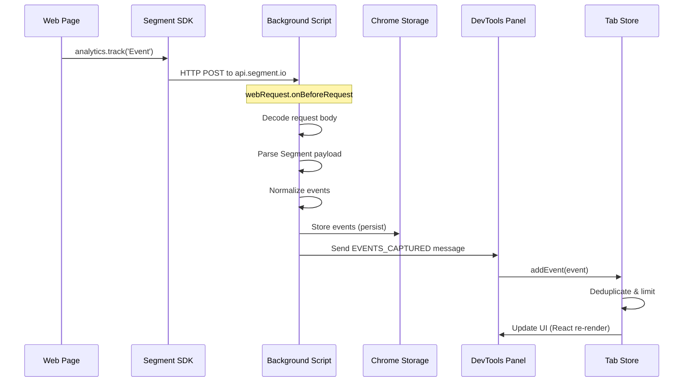
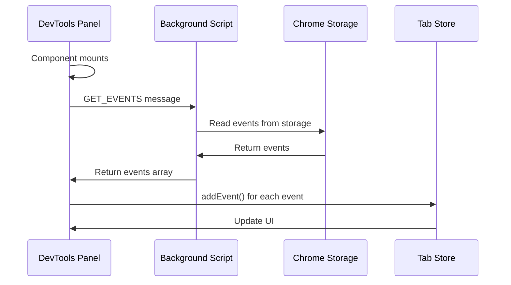
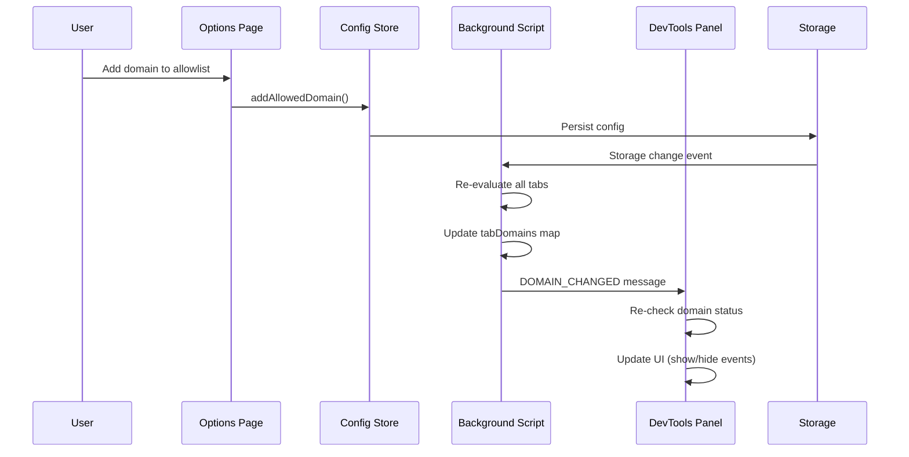

# Architecture Documentation

This document describes the architecture of the analytics-x-ray browser extension.

## Table of Contents

- [Overview](#overview)
- [System Architecture](#system-architecture)
- [Data Flow](#data-flow)
- [Extension Contexts](#extension-contexts)
- [Storage Strategy](#storage-strategy)
- [Event Capture Flow](#event-capture-flow)
- [State Management](#state-management)

## Overview

Analytics X-Ray is a browser extension that intercepts and displays Segment analytics events in real-time. It uses Chrome's Manifest V3 architecture with a service worker (background script) and DevTools panel.

## System Architecture

```
┌─────────────────────────────────────────────────────────────┐
│                    Browser Extension                          │
├─────────────────────────────────────────────────────────────┤
│                                                               │
│  ┌──────────────────┐         ┌──────────────────┐         │
│  │  Background       │         │  DevTools Panel  │         │
│  │  Service Worker   │◄───────►│  (React UI)      │         │
│  │                   │ Messages│                  │         │
│  │  - webRequest     │         │  - Event List    │         │
│  │  - Event Storage  │         │  - Event Details │         │
│  │  - Domain Tracking│         │  - Search/Filter │         │
│  └──────────────────┘         └──────────────────┘         │
│           │                            │                    │
│           │                            │                    │
│           ▼                            ▼                    │
│  ┌──────────────────┐         ┌──────────────────┐         │
│  │  Chrome Storage  │         │  Zustand Stores  │         │
│  │  (persistence)   │         │  (in-memory)     │         │
│  └──────────────────┘         └──────────────────┘         │
│                                                               │
└─────────────────────────────────────────────────────────────┘
           │
           │ Intercepts
           ▼
┌─────────────────────────────────────────────────────────────┐
│              Web Page (Segment Analytics)                    │
│                                                               │
│  ┌─────────────────────────────────────────────────────┐    │
│  │  Segment SDK                                        │    │
│  │  - analytics.track()                                │    │
│  │  - analytics.page()                                │    │
│  │  - analytics.identify()                            │    │
│  └─────────────────────────────────────────────────────┘    │
│                        │                                      │
│                        │ HTTP POST                            │
│                        ▼                                      │
│  ┌─────────────────────────────────────────────────────┐    │
│  │  api.segment.io/v1/batch                           │    │
│  └─────────────────────────────────────────────────────┘    │
└─────────────────────────────────────────────────────────────┘
```

## Data Flow

### Event Capture Flow



### Initial Load Flow



### Domain Allowlist Flow



## Extension Contexts

### Background Service Worker

**Location:** `src/pages/background/`

**Responsibilities:**
- Intercept network requests via `webRequest` API
- Parse Segment payloads
- Store events in Chrome storage
- Track domain allowlist/denylist
- Detect page reloads
- Handle runtime messages
- Clean up stale tab data

**Key Modules:**
- `handlers/webRequestHandler.ts` - Request interception
- `handlers/messageHandler.ts` - Runtime message handling
- `handlers/domainHandler.ts` - Domain tracking
- `handlers/reloadHandler.ts` - Reload detection
- `utils/eventStorage.ts` - Event storage operations
- `utils/domainTracking.ts` - Domain utilities

### DevTools Panel

**Location:** `src/pages/devtools/`

**Responsibilities:**
- Display events in real-time
- Provide search and filtering
- Show event details
- Manage UI state

**Key Components:**
- `Panel.tsx` - Main panel component
- `components/EventList.tsx` - Virtualized event list
- `components/EventRow.tsx` - Individual event row
- `components/detail/EventDetailView.tsx` - Event details
- `hooks/useEventSync.ts` - Event synchronization

### Options Page

**Location:** `src/pages/options/`

**Responsibilities:**
- Configure extension settings
- Manage domain allowlist/denylist
- Set max events limit
- Configure theme preferences

## Storage Strategy

### Storage Structure

```
Chrome Storage Local:
├── analytics-xray-config          # Config store (Zustand persisted)
├── events                          # Event storage (per tab)
│   ├── [tabId]: SegmentEvent[]
│   └── ...
├── tab_${tabId}_store             # Tab store (Zustand persisted)
└── tab_${tabId}_reloads           # Reload timestamps
```

### Storage Adapters

The extension uses custom storage adapters compatible with Zustand's persist middleware:

- **Chrome Storage Adapter** (`createChromeStorage`)
  - Used for config store
  - Key: `analytics-xray-config`

- **Tab Storage Adapter** (`createTabStorage`)
  - Used for tab stores
  - Key prefix: `tab_${tabId}_store`

### Storage Cleanup

- **Automatic cleanup** on tab close
- **Periodic cleanup** of stale tabs (every hour)
- **Manual cleanup** via storage utilities

## Event Capture Flow

### Step-by-Step Process

1. **Request Interception**
   - Background script listens for requests to Segment endpoints
   - Uses `webRequest.onBeforeRequest` with `requestBody` permission

2. **Domain Filtering**
   - Check if domain is in allowlist
   - Check if domain is in denylist
   - Skip processing if not allowed

3. **Payload Decoding**
   - Decode ArrayBuffer request body to string
   - Handle UTF-8 encoding

4. **Payload Parsing**
   - Parse JSON string
   - Validate Segment batch structure
   - Handle single events (convert to batch format)

5. **Event Normalization**
   - Convert batch events to `SegmentEvent` format
   - Generate fallback IDs if missing
   - Add metadata (tabId, capturedAt, url, provider)

6. **Storage**
   - Store in-memory (Map<tabId, events[]>)
   - Persist to Chrome storage
   - Respect maxEvents limit

7. **Notification**
   - Send `EVENTS_CAPTURED` message to listeners
   - Panel receives message and adds to store

8. **Deduplication**
   - Tab store checks for duplicates by `id` and `messageId`
   - Prevents duplicate events in UI

## State Management

### Config Store

**Purpose:** Global extension configuration

**State:**
- `maxEvents` - Maximum events to store
- `theme` - UI theme preference
- `preferredEventDetailView` - Default view mode
- `pinnedProperties` - Pinned property configurations
- `sectionDefaults` - Section expansion defaults

**Persistence:** Chrome storage.local

### Tab Store

**Purpose:** Per-tab event data and UI state

**State:**
- `events` - Array of captured events
- `selectedEventId` - Currently selected event
- `expandedEventIds` - Set of expanded event IDs
- `hiddenEventNames` - Set of hidden event names
- `searchQuery` - Current search query
- `reloadTimestamps` - Page reload timestamps

**Persistence:** Chrome storage.local (per tab)

**Isolation:** Each tab has its own store instance

### State Flow

```
Background Script          DevTools Panel
     │                           │
     │ 1. Capture Event          │
     │                           │
     │ 2. Store in Memory        │
     │    & Persist              │
     │                           │
     │ 3. Send Message ──────────┼──► 4. Receive Message
     │                           │
     │                           │ 5. Add to Tab Store
     │                           │
     │                           │ 6. Store Deduplicates
     │                           │
     │                           │ 7. React Re-renders
     │                           │
     │                           │ 8. UI Updates
```

## Message Types

### Background → Panel

- `EVENTS_CAPTURED` - New events captured
- `RELOAD_DETECTED` - Page reload detected
- `DOMAIN_CHANGED` - Domain changed for tab

### Panel → Background

- `GET_EVENTS` - Request events for tab
- `CLEAR_EVENTS` - Clear events for tab
- `GET_EVENT_COUNT` - Get event count for tab
- `GET_TAB_DOMAIN` - Get domain for tab
- `RE_EVALUATE_TAB_DOMAIN` - Re-evaluate domain allowlist

## Error Handling

### Error Boundaries

- Panel component wrapped in ErrorBoundary
- EventList wrapped in ErrorBoundary
- EventDetailView wrapped in ErrorBoundary

### Error Recovery

- Graceful degradation on parse errors
- Fallback to default values
- User-friendly error messages

## Performance Considerations

### Virtualization

- EventList uses `@tanstack/react-virtual` for virtualization
- Only renders visible items
- Handles large event lists efficiently

### Throttling

- Search input debounced (250ms)
- Storage operations batched
- Message listeners cleaned up on unmount

### Memory Management

- Events limited by `maxEvents` setting
- Old events automatically trimmed
- Tab data cleaned up on tab close
- Stale tabs cleaned periodically

## Security

### Content Security Policy

- Extension manifest includes CSP
- No inline scripts
- External resources whitelisted

### Data Handling

- Events stored locally only
- No external data transmission
- Input validation on domain entries

## Future Enhancements

### Potential Improvements

- Export events to file
- Filter by event properties
- Event replay functionality
- Custom event buckets
- Multi-tab view
- Event statistics dashboard
